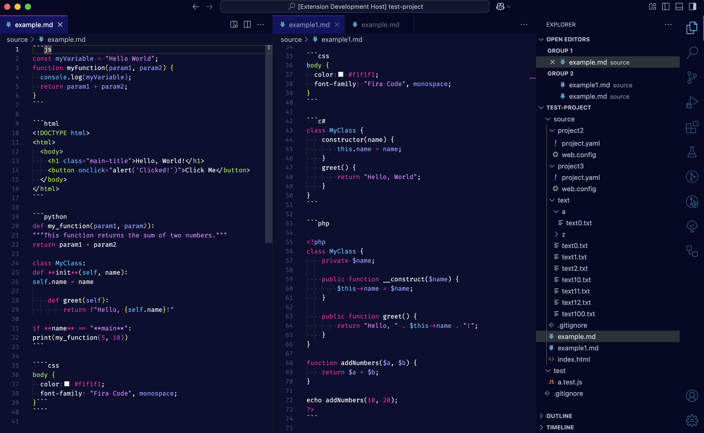
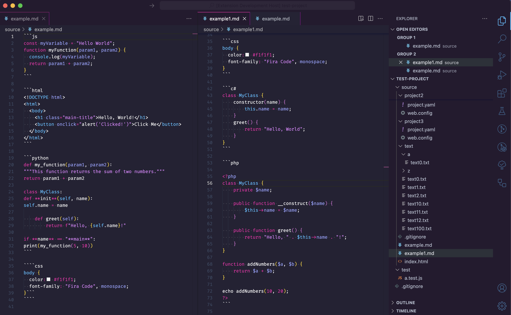
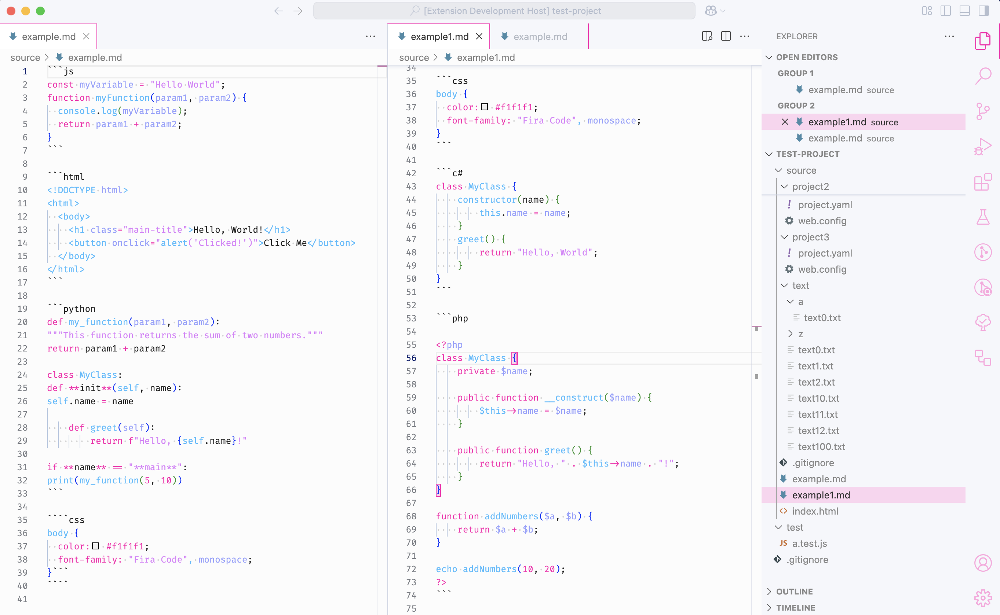

# 1986 Theme for Visual Studio Code



A retro-inspired **VS Code theme** bringing the neon aesthetics of the **1980s** into your editor. Inspired by [vs-1984](https://github.com/juanmnl/vs-1984), this theme enhances readability while maintaining a bold 80's look.

## Features

- **Semi-High Contrast & Vibrant Colors** 🎨
- **Neon-inspired syntax highlighting** ⚡️
- **Great readability for coding** 💾
- **Supports your favorite language** 🖥️

## Installation

1. Open **VS Code**
2. Go to **Extensions** (`Cmd + Shift + X` or `Ctrl + Shift + X`)
3. Search for **1986**
4. Click **Install**
5. Open Command Palette (`Cmd + Shift + P` or `Ctrl + Shift + P`) and select **Preferences: Color Theme**
6. Choose **1986 - Dark**

`1986 - Dark`


`1986 - Dark (Muted)`



`1986 - Light`



## Development

If you want to modify this theme yourself:

```sh
npm install
```

Run the `Extension` task

### Package

```sh
npm run package
```

## Contributing

Feel free to **open issues** or **submit PRs** to improve the theme!

## License

[MIT License](LICENSE)
